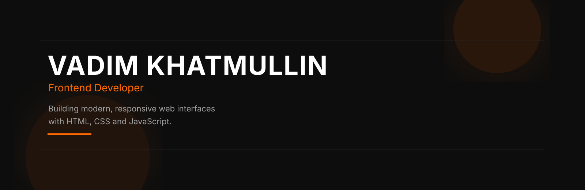
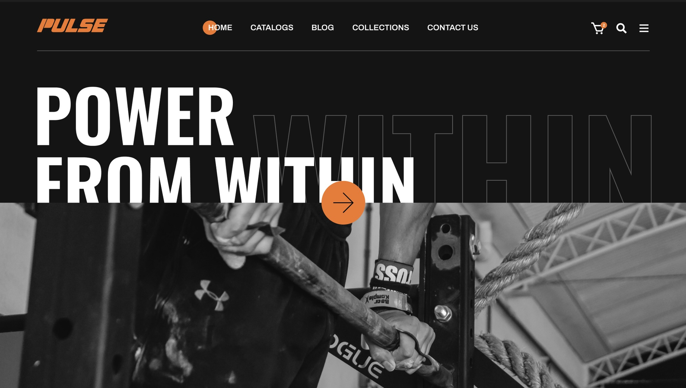
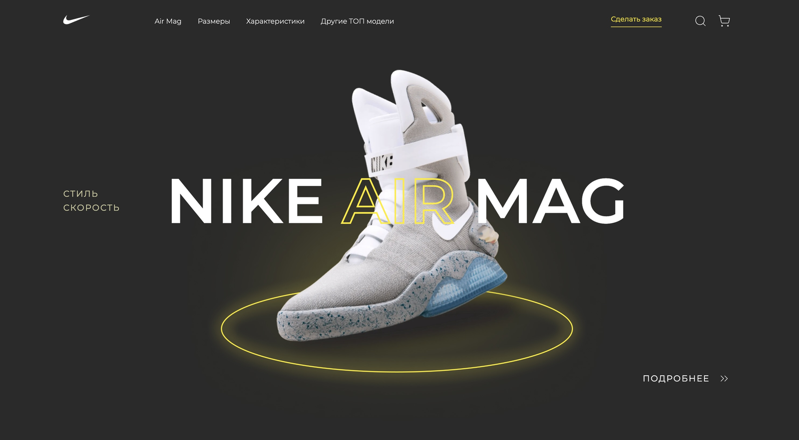

  

    

## About

Frontend developer passionate about building modern, responsive and visually polished web interfaces.

I enjoy turning Figma designs into clean, maintainable code while focusing on performance, accessibility and user experience.

Currently improving my JavaScript skills and preparing to work with React to build scalable frontend applications.

    

## Featured Projects

<table>
<tr>

<td width="50%" valign="top">

### Pulse Fitness Center

Responsive fitness center landing page developed from a Figma design.

**Highlights**

- Responsive Layout
- Pixel Perfect
- BEM Methodology
- CSS Grid & Flexbox
- Interactive UI
- JavaScript Components

**Stack**

`HTML5` `CSS3` `JavaScript`

 

</td>

<td width="50%" valign="top">

### Nike Air Mag

Modern product landing page recreated from a Figma design.

**Highlights**

- Responsive Layout
- CSS Animations
- DOM Manipulation
- Flexbox
- CSS Grid
- Interactive UI
- JavaScript Components

**Stack**

`HTML5` `CSS3` `JavaScript`

 

</td>

</tr>
</table>

    

## Tech Stack

<table>
<tr>

<td align="center" width="33%">

### Frontend

HTML5 • CSS3 • JavaScript

</td>

<td align="center" width="33%">

### Tools

Git • GitHub • VS Code

</td>

<td align="center" width="33%">

### Design

Figma • UI Design

</td>

</tr>
</table>

    

## Let's Connect

&nbsp;&nbsp;•&nbsp;&nbsp;
&nbsp;&nbsp;•&nbsp;&nbsp;

<a href="https://t.me/xitsuma">Telegram</a>
&nbsp;&nbsp;•&nbsp;&nbsp;
&nbsp;&nbsp;•&nbsp;&nbsp;
<a href="mailto:khatmullinv@list.ru">Email</a>

Made with ❤️ by Vadim Khatmullin

